# Gamepad decoder DTMF
Thanks to the MT8870 chip, connecting the outputs of STQ, Q4, Q3, Q2 and Q1 to a transistor allowing to open or close
the buttons of a GAMEPAD, DTMF tones can be decoded. We only ineed 5 pins (control buttons)
It has been created as proof of concept a simple program in VB6 (to work in old equipment W95) to be able to
read the buttons and translate it to DTMF tones.
The program is not optimized, so send the tones slowly.
You can use the web generator
<a href="http://mamclain.com/?page=RND_SOFTWARE_DTMF_WEB_APP">http://mamclain.com/?page=RND_SOFTWARE_DTMF_WEB_APP</a>

Can be tested with Windows' own joystick tester

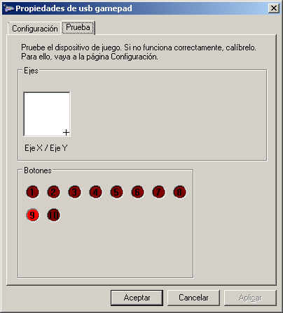

It is recommended to put 500 ms in the ms Delay Between Digits at the time of sending.

So far we have the hardware logic part. Therefore, we enter in the section to build an application that translates the button presses in the binary codes that at the end are DTMF codes.
<ul>
 <li><b>0001</b> 1</li>
 <li><b>0010</b> 2</li>
 <li><b>0011</b> 3</li>
 <li><b>0100</b> 4</li>
 <li><b>0101</b> 5</li>
 <li><b>0110</b> 6</li>
 <li><b>0111</b> 7</li>
 <li><b>1000</b> 8</li>
 <li><b>1001</b> 9</li>
 <li><b>1010</b> 10 0</li>
 <li><b>1011</b> 11 *</li>
 <li><b>1100</b> 12 #</li>
 <li><b>1101</b> 13 A</li>
 <li><b>1110</b> 14 B</li>
 <li><b>1111</b> 15 C</li>
 <li><b>0000</b> 16 D</li>
</ul>
The program in Visual Basic, allows to select which buttons we want to use of the control as well as to which pin of the MT8870
is associated. The command that has been used has been opted for:
<ul>
 <li><b>STQ</b> (10)</li>
 <li><b>Q4</b> (01)</li>
 <li><b>Q3</b> (X1) I used the crosshead to move analog right</li>
 <li><b>Q2</b> (Y1) I've used the crosshead to move down analog</li>
 <li><b>Q1</b> (9)</li>
</ul>

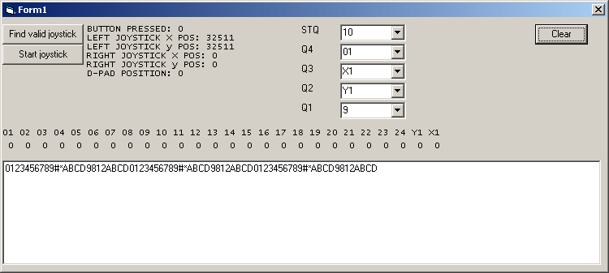

X1 and Y1 are the X and Y axes (analog). In this case, it is so because I have used the NES usb retro controller and only
4 digital buttons are available, being the analogical cross. On ASIX (axes) it is not possible to press left and
right at the same time, as well as up or down (take it into account when soldering), as well as the 4 buttons,
I recommend using all digital buttons, and the STQ always use digital.

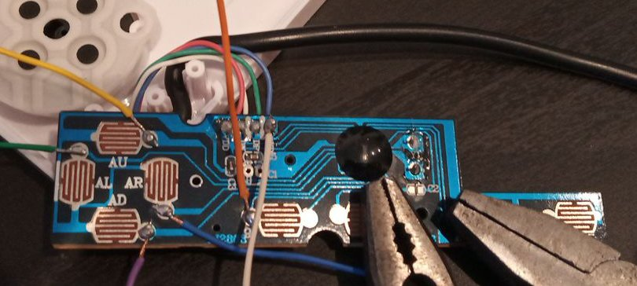

In the readings of the Asix (X1 and Y1) being analogical a value greater than 33768 is checked by code so that it is a logical 1, since it means that we have pressed the button or to the right (greater than 32768 that would be the center) or downwards.

The concept is very simple, being the most difficult part in the manualities, to leave the control well prepared. The MT8870 can be powered with the 5 volts of usb, which we can take out following the cables of the control with a mulitester. The mass follows the same concept.
The buttons of the controls, usually join 2 circuits, leaving the mass in common. To be sure we will look with a multitester the mass. What we are interested in is soldering the part of the button that is not mass. That part will go to the transistor collector. Since masses are common, we don't need to weld all those parts. At the base of each transistor, we must connect a resistance of 100 Ohms, as protection. The transistor is worth any NPN, in particular I have used the 2N3904, which is the simplest and cheapest to get.
Each output of the MT8870 (STQ, Q4, Q3, Q2 and Q1), goes to the resistance of 100 Ohms, and this in series goes to the base of the transistor (2N3904), while the collector joins it to the part of the button of the control that we want to activate and the emitter to the mass of the control.

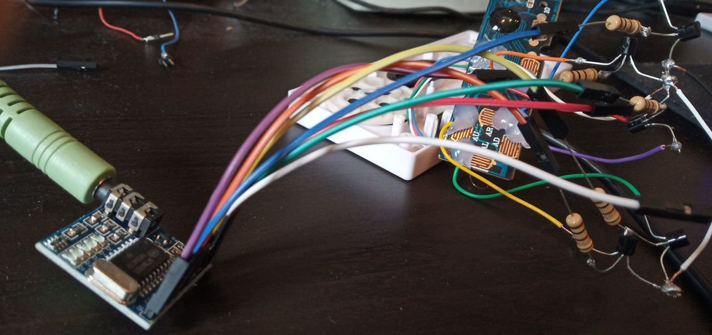

It is necessary to emphasize, that the cheaper the control, the less possibilities exist that it is possible to weld well to the part of the button, reason why we will have to make sure to put once welded of simple way, glue above to make pressure.

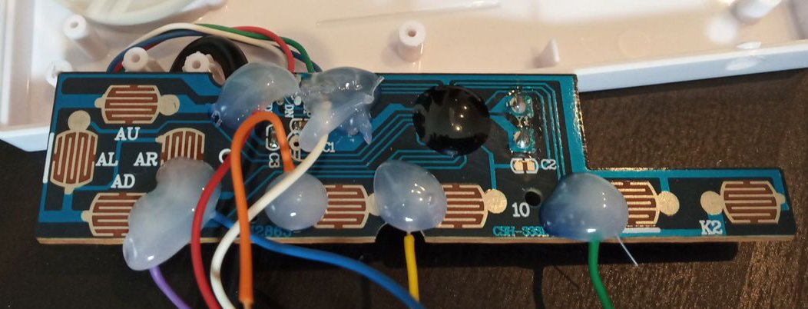

Then we make a hole with the drill to be able to introduce the audio jack of the MT8870 module when we want to connect it so that it looks good, and finished:

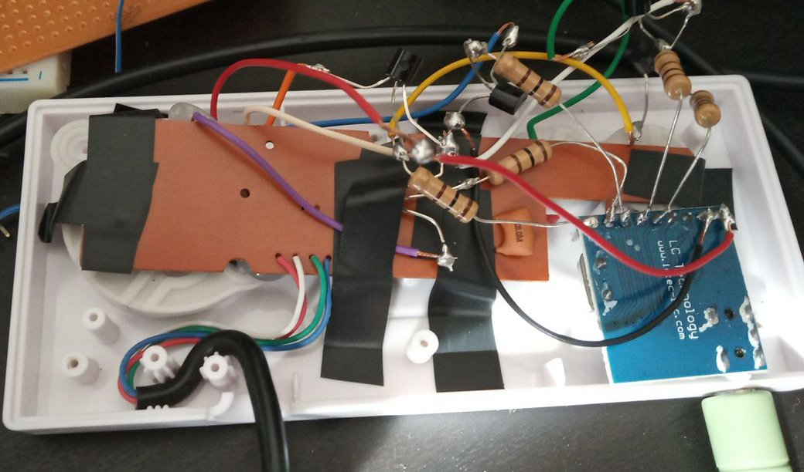

Once we test the program, we must hit the button <b>start joystick </b> and of course have the gamepad connected. If everything is correct, and the buttons have been chosen correctly, we will see the status of up to the first 24 buttons of the gamepad and below all DTMF codes that are decoded in real time, the sound source that we have connected.

<h2>Conclusion </h2>
With this we get to be able to decode DTMF with a control, without lack of any intermediate microcontroller, and most importantly, that the concept can be applied to old gamepads (MIDI connector), and retro equipment (MSDOS), as well as new, such as mobile, being able to portray the concept to HTML5.

If we do not want to compile the program, we can make use of the already compiled version
<a href="WINDOWS/VB6/GamePadDTMF.zip">GamePadDTMF.zip</a>
 

<h2>RETRO</h2>
There is also available a retro version <b>(GAMEPAD.PAS)</b> compatible with 8086, to work in any old equipment (IBM PC XT), as well as emulated by means of the DOSBOX, which means that it works in almost any platform, as for example ANDROID.
The prototype is in PASCAL.

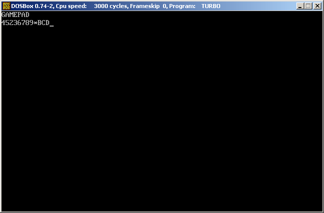

The joystick port is used with the interruption 0x15h, using only the 3 high bits 01110000b of the buttons, similar to the version of VB6, but here you can not modify the buttons.

<ul>
 <li><b>STQ</b> (bit 7)</li>
 <li><b>Q4</b> (bit 6)</li>
 <li><b>Q3</b> I used the crosshead to move analogical right </li>
 <li><b>Q2</b> I used the crosshead to move down analog </li>
 <li><b>Q1</b> (bit 5)</li>
</ul>

We must then remap from the DOSBOX (press ctrl+F1) joystick buttons 1 and 2, so that the buttons of our real gamepad point to the virtual joystick to emulate (IBM PC):
<ul>
 <li>1 (Axis 1/2) - Q1</li>
 <li>2 (Axis 1/2) - Q4</li>
 <li>3 (Asix 3/4) - STQ</li>
 <li>right cross - Q3</li>
 <li>cross down - Q2</li>
</ul>

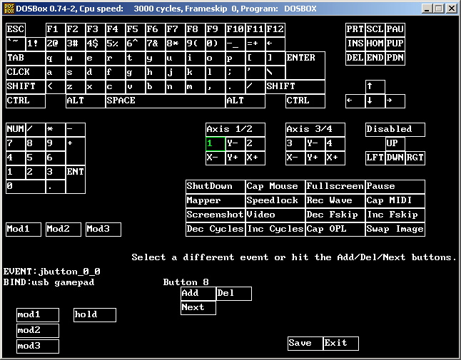

As you work from an emulator, there is a lag, that if tones occur very closely without separation (silence), does not detect a change of pulse in STQ, so it will not detect the digit well. It is recommended to use the DTMF keyboard generator by hand, because there if you enter silence.

I left a minimum version (228 bytes), but it is faulty. It is made in C--, but its size can be reduced even more.

<h2>ARDUINO HID </h2>
If you have an Arduino R3 ATMEGA328 board with the ATMEGA 16u2 communications chip, you can use the modified code big_joystick_dtmf to emulate a joystick with 40 HID buttons, which are activated by the MT8870 signals we have connected to the pins:

<ul>
 <li>stq - 2</li>
 <li>q4 - 3</li>
 <li>q3 - 4</li>
 <li>q2 - 5</li>
 <li>q1 - 6</li>
</ul> 

The buttons on the remote are:
<ul>
 <li>stq - 10</li>
 <li>q4 - 1</li>
 <li>q3 - 2</li>
 <li>q2 - 3</li>
 <li>q1 - 4</li>
</ul>

It is required to previously flash the chip ATMEGA16u2 with:

<a href="https://github.com/harlequin-tech/arduino-usb">https://github.com/harlequin-tech/arduino-usb</a>

Use the FLIP tool and put the chip in DFU mode.

 
<h2>HTML5</h2>

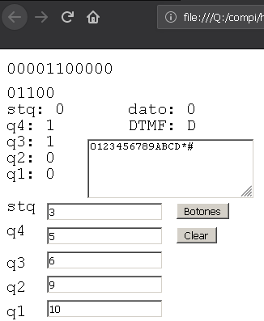

I have created an html5 version that reads from the gamepad. It makes use of p5js.
 

 
<h2>AMSTRAD CPC 464</h2>

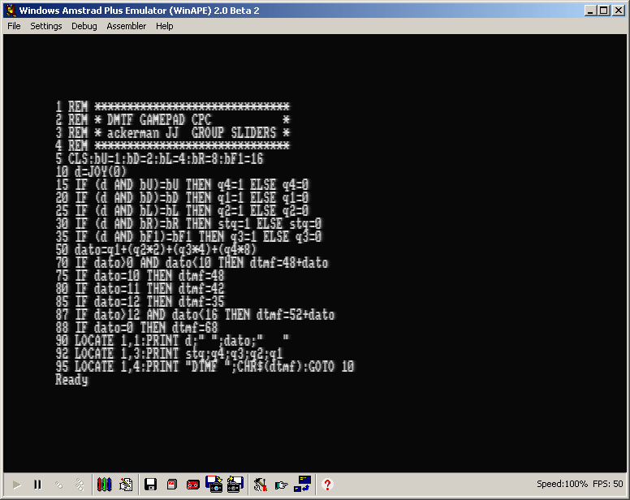

I created a very simple program to read from the game port of the AMSTRAD CPC 464 in BASIC. It allows to decode the tones following the same concept seen until now. I have tested it in emulator, so you have to remap the buttons or adapt the code to assign the correct pins:
<ul>
 <li>stq - Right</li>
 <li>q4 - Up</li>
 <li>q3 - Fire 1</li>
 <li>q2 - Left</li>
 <li>q1 - Down</li>
</ul>

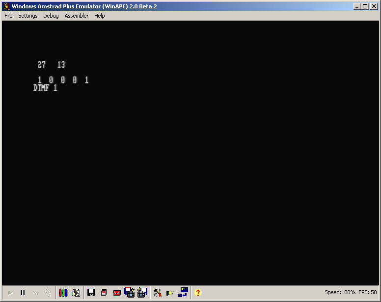

To remap the buttons I used the antimicro program
<a href="https://github.com/AntiMicro/antimicro">https://github.com/AntiMicro/antimicro</a>
And the Winape emulator.

 

<h2>Historical </h2>
<ul>
 <li><b>2019/12/04</b> AMSTRAD CPC 464 port</li>
 <li><b>2019/07/23</b> HTML5 port</li>
 <li><b>2019/07/21</b> Arduino R3 ATMEGA16u2 big_joystick_dtmf converts MT8870 into HID joystick</li>
 <li><b>2019/04/23</b> The world's smallest version of MSDOS and DOSBOX has been created in C-- (228 bytes)</li>
 <li><b>2019/04/22</b> Corrected version MSDOS (PASCAL) works OK</li>
 <li><b>2019/04/19</b> Version for MSDOS and DOSBOX (PASCAL).</li>
 <li><b>2019/04/18</b> Semioptimized version that allows to decode up to 150 milis of waiting </li>
</ul>

      

# Gamepad decodificador DTMF
Gracias al chip MT8870, conectando las salidas de STQ, Q4, Q3, Q2 y Q1 a un transistor permitiendo abrir o cerrar
los botones de un GAMEPAD, se puede decodificar tonos DTMF. Tan sólo necesitamos 5 pines (botones de mando)
Se ha creado como prueba de concepto un simple programa en VB6 (para que funcione en equipos viejos W95) para poder
leer los botones y traducirlo a tonos DTMF.
El programa está sin optimizar, así que hay que enviar los tonos lentamente.
Se puede usar el generador de la web
<a href="http://mamclain.com/?page=RND_SOFTWARE_DTMF_WEB_APP">http://mamclain.com/?page=RND_SOFTWARE_DTMF_WEB_APP</a>

Se pueden hacer pruebas con el propio testeador de joystick de Windows

Se recomienda poner 500 ms en el ms Delay Between Digits a la hora de enviar.

Hasta aqui tenemos la parte lógica hardware. Por tanto, entramos en la sección de construir una aplicación que se encargue de traducir las pulsaciones de botones en los códigos binarios que al final son códigos DTMF.
<ul>
 <li><b>0001</b> 1</li>
 <li><b>0010</b> 2</li>
 <li><b>0011</b> 3</li>
 <li><b>0100</b> 4</li>
 <li><b>0101</b> 5</li>
 <li><b>0110</b> 6</li>
 <li><b>0111</b> 7</li>
 <li><b>1000</b> 8</li>
 <li><b>1001</b> 9</li>
 <li><b>1010</b> 10 0</li>
 <li><b>1011</b> 11 *</li>
 <li><b>1100</b> 12 #</li>
 <li><b>1101</b> 13 A</li>
 <li><b>1110</b> 14 B</li>
 <li><b>1111</b> 15 C</li>
 <li><b>0000</b> 16 D</li>
</ul>

El programa en Visual Basic, permite seleccionar que botones queremos usar del mando así, como a que pin del MT8870
está asociado. El mando que se ha usado se ha optado por:
<ul>
 <li><b>STQ</b> (10)</li>
 <li><b>Q4</b> (01)</li>
 <li><b>Q3</b> (X1) He usado la cruceta mover derecho analógico</li>
 <li><b>Q2</b> (Y1) He usado la cruceta mover abajo analógico</li>
 <li><b>Q1</b> (9)</li>
</ul>

El X1 e Y1 son los Ejes X e Y (analógicos). En este caso, es así porque he usado el mando retro de NES usb y sólo
se dispone de 4 botones digitales, siendo la cruceta analógica. En los ASIX (ejes) no se puede pulsar izquierda y
derecha al mismo tiempo, así como arriba o abajo (tenerlo en cuenta a la hora de soldar), así que de los 4 botones,
sólo se pueden usar 2. Recomiendo usar todo botones digitales, y el STQ usarlo siempre digital.

En las lecturas de los Asix (X1 e Y1) al ser analógico se comprueba por código un valor mayor de 33768 para que sea un 1 lógico, ya que significa que hemos pulsado el bóton o a la derecha (mayor a 32768 que sería el centro) o hacia abajo.

El concepto es muy simple, estando la parte más dificil en las manualidades, para dejar el mando bien preparado. El MT8870 se puede alimentar con los 5 voltios del usb, que podemos sacarlo siguiendo los cables del mando con un mulitester. La masa, sigue el mismo concepto.
Los botones de los mandos, normalmente suelen unir 2 circuitos, dejando la masa en común. Para estar seguros miraremos con un multitester la masa. Lo que nos interesa es soldar en la parte del botón que no es masa. Ese parte irá al colector del transistor. Como las masas son comunes, no necesitamos soldar todas esas partes. A la base de cada transistor, debemos conectar una resistencia de 100 Ohmios, como protección. El transistor vale cualquier NPN, en concreto he usado el 2N3904, que es el más simple y barato de conseguir.
Cada salida del MT8870 (STQ, Q4, Q3, Q2 y Q1), van a la resistencia de 100 Ohmios, y esta en serie va a la base del transistor (2N3904), mientras que el colector lo únimos a la parte del botón del mando que queremos activar y el emisor a la masa del mando.

Hay que destacar, que cuanto más barato sea el mando, menos posibilidades existen de que se pueda soldar bien a la parte del botón, por lo que deberemos asegurarnos de poner una vez soldado de manera simple, cola por encima para hacer presión.

Luego hacemos un agujero con el taladro para poder introducir el jack de audio del modulo MT8870 cuando queramos conectarlo para que quede bien, y terminado:

Una vez que probemos el programa, le debemos dar al botón de <b>start joystick</b> y por supuesto tener el gamepad conectado. Si todo es correcto, y se han elegido bien los botones, nos aparecerá el estado de hasta los 24 primeros botones del gamepad y debajo todos los codigos DTMF que se van decodificando en tiempo real, de la fuente de sonido que le hayamos conectado.

<h2>Conclusión</h2>
Con esto conseguimos poder decodificar DTMF con un mando, sin falta de ningún microcontrolador intermedio, y lo más importante, que el concepto se puede aplicar a gamepads viejos (conector MIDI), y equipos retro (MSDOS), así como nuevos, como móviles, pudiendo portar el concepto a HTML5.

Si no queremos compilar el programa, podemos hacer uso de la versión ya compilada
<a href="WINDOWS/VB6/GamePadDTMF.zip">GamePadDTMF.zip</a>

<h2>RETRO</h2>
También se encuentra disponible una versión retro <b>(GAMEPAD.PAS)</b> compatible con 8086, para que funcione en cualquier equipo viejo (IBM PC XT), así como emulado por medio del DOSBOX, lo que se traduce en que funciona en casi cualquier plataforma, como por ejemplo ANDROID.
El prototipo está en PASCAL.

Se usa el puerto de joystick con la interrupción 0x15h, usando sólo los 3 bits altos 01110000b de los botones, similar a la versión de VB6, pero aqui no se puede modificar los botones.

<ul>
 <li><b>STQ</b> (bit 7)</li>
 <li><b>Q4</b> (bit 6)</li>
 <li><b>Q3</b> He usado la cruceta mover derecho analógico</li>
 <li><b>Q2</b> He usado la cruceta mover abajo analógico</li>
 <li><b>Q1</b> (bit 5)</li>
</ul>

Debemos pues remapear desde el DOSBOX (pulsar ctrl+F1) los botones del joystick 1 y el 2, de forma que los botones de nuestro gamepad real apunten al joystick virtual a emular (IBM PC):
<ul>
 <li>1 (Axis 1/2) - Q1</li>
 <li>2 (Axis 1/2) - Q4</li>
 <li>3 (Asix 3/4) - STQ</li>
 <li>cruceta derecha - Q3</li>
 <li>cruceta abajo - Q2</li>
</ul>

Como se trabaja desde un emulador, existe un lag, que si ocurren tonos muy seguidos sin separación (silencio), no detecta un cambio de pulso en STQ, por lo que no detectará bien el digito. Se recomienda usar el generador de teclado DTMF a mano, ya que ahi si se introduce silencio.

He dejado una versión minima (228 bytes), pero tiene fallos. Está realizada en C--, pero se puede reducir aún más su tamaño.

<h2>ARDUINO HID</h2>
Si se dispone de una placa Arduino uno R3 ATMEGA328 con el chip de comunicaciones ATMEGA 16u2, se puede hacer uso del código modificado big_joystick_dtmf para poder emular un joystick de 40 botones HID, que se activan por las señales del MT8870 que hemos conectado a los pines:

<ul>
 <li>stq - 2</li>
 <li>q4 - 3</li>
 <li>q3 - 4</li>
 <li>q2 - 5</li>
 <li>q1 - 6</li>
</ul> 

Los botones del mando son:
<ul>
 <li>stq - 10</li>
 <li>q4 - 1</li>
 <li>q3 - 2</li>
 <li>q2 - 3</li>
 <li>q1 - 4</li>
</ul>

Se requiere previamente flashear el chip ATMEGA16u2 con:

https://github.com/harlequin-tech/arduino-usb

Se debe usar la herramienta FLIP y poner el chip en modo DFU.

 
<h2>HTML5</h2>

I have created an html5 version that reads from the gamepad. It makes use of p5js.
 

<h2>Histórico</h2>
<ul>
 <li><b>2019/07/23</b> Soporte HTML5</li>
 <li><b>2019/07/21</b> Arduino R3 ATMEGA16u2 big_joystick_dtmf convierte MT8870 en HID joystick</li>
 <li><b>2019/04/23</b> Creada la versión más pequeña del mundo MSDOS y DOSBOX en C-- (228 bytes)</li>
 <li><b>2019/04/22</b> Corregida versión MSDOS (PASCAL) funciona OK</li>
 <li><b>2019/04/19</b> Versión para MSDOS y DOSBOX (PASCAL).</li>
 <li><b>2019/04/18</b> Versión semioptimizada que permite decodificar hasta con 150 milis de espera</li>
</ul>
