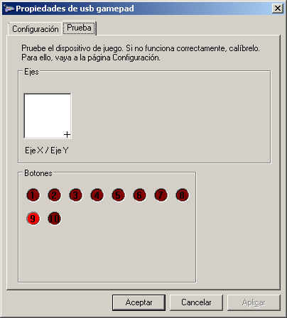
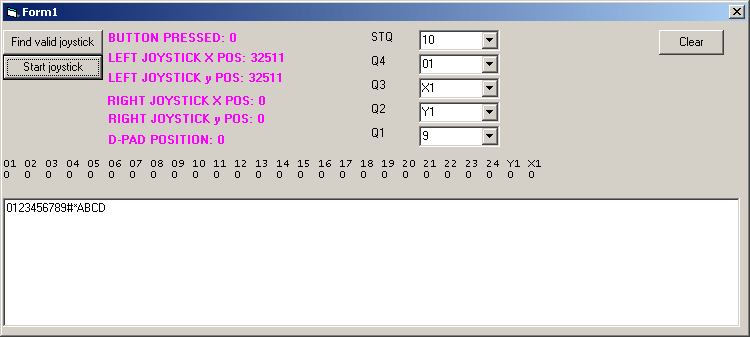
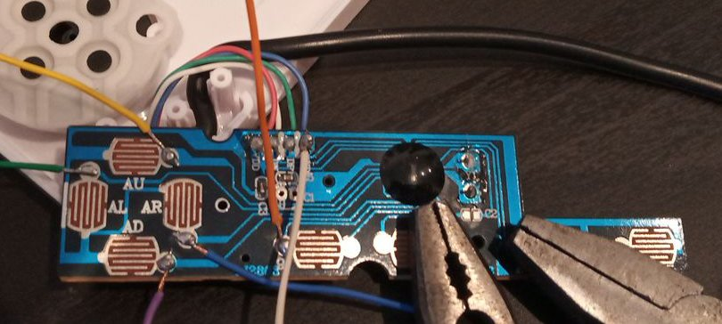
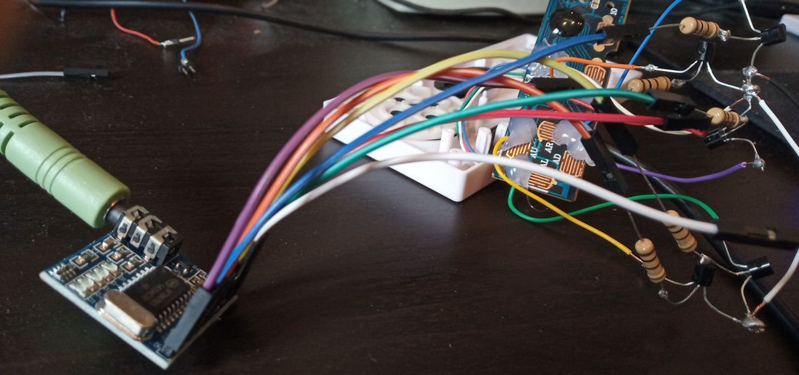
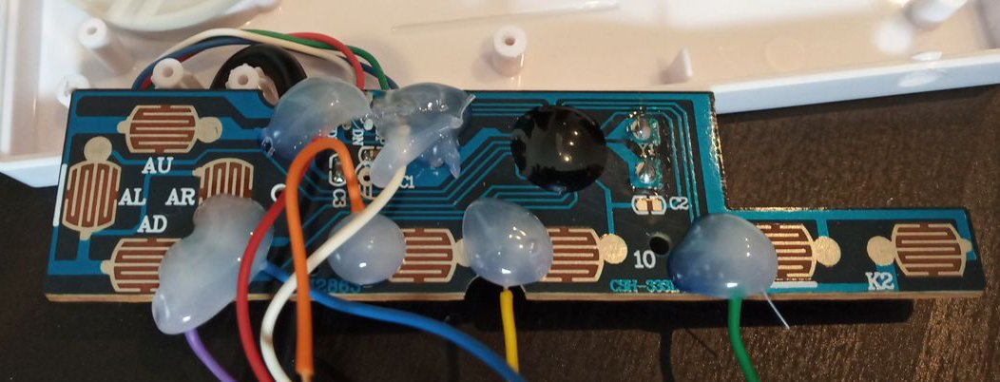
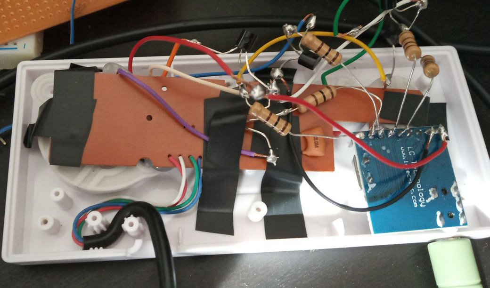

# gamepadDTMF
Gamepad HID decode DTMF 
Gracias al chip MT8870, conectando las salidas de STQ, Q4, Q3, Q2 y Q1 a un transistor permitiendo abrir o cerrar
los botones de un GAMEPAD, se puede decodificar tonos DTMF. Tan sólo necesitamos 4 pines (botones de mando)
Se ha creado como prueba de concepto un simple programa en VB6 (para que funcione en equipos viejos W95) para poder
leer los botones y traducirlo a tonos DTMF.
El programa está sin optimizar, así que hay que enviar los tonos lentamente.
Se puede usar el generador de la web
<a href="http://mamclain.com/?page=RND_SOFTWARE_DTMF_WEB_APP">http://mamclain.com/?page=RND_SOFTWARE_DTMF_WEB_APP</a>

Se pueden hacer pruebas con el propio testeador de joystick de Windows

Se recomienda poner 500 ms en el ms Delay Between Digits a la hora de enviar.

El programa en Visual Basic, permite seleccionar que botones queremos usar del mando así, como a que pin del MT8870
está asociado. El mando que se ha usado se ha optado por:
<ul>
 <li><b>STQ</b> (10)</li>
 <li><b>Q4</b> (01)</li>
 <li><b>Q3</b> (X1) He usado la cruceta mover derecho analógico</li>
 <li><b>Q2</b> (Y1) He usado la cruceta mover abajo analógico</li>
 <li><b>Q1</b> (9)</li>
</ul>

El X1 e Y1 son los Ejes X e Y (analógicos). En este caso, es así porque he usado el mando retro de NES usb y sólo
se dispone de 4 botones digitales, siendo la cruceta analógica. En los ASIX (ejes) no se puede pulsar izquierda y
derecha al mismo tiempo, así como arriba o abajo (tenerlo en cuenta a la hora de soldar), así que de los 4 botones,
sólo se pueden usar 2. Recomiendo usar todo botones digitales, y el STQ usarlo siempre digital.

El concepto es muy simple, estando la parte más dificil en las manualidades, para dejar el mando bien preparado. El MT8870 se puede alimentar con los 5 voltios del usb, que podemos sacarlo siguiendo los cables del mando con un mulitester. La masa, sigue el mismo concepto.
Los botones de los mandos, normalmente suelen unir 2 circuitos, dejando la masa en común. Para estar seguros miraremos con un multiester la masa. Lo que nos interesa es soldar en la parte del botón que no es masa. Ese parte irá al colector del transistor. Como las masas son comunes, no necesitamos soldar todas esas partes. A la base de cada transistor, debemos conectar una resistencia de 100 Ohmios, como protección. El transistor vale cualquier NPN, en concreto he usado el 2N3904, que es el más simple y barato de conseguir.

Hay que destacar, que cuanto más barato sea el mando, menos posibilidades existen de que se pueda soldar bien a la parte del botón, por lo que deberemos asegurnos de poner una vez soldado de manera simple, cola por encima para hacer presión.

Luego hacemos un agujero con el taladro para poder introducir el jack de audio del modulo MT8870 cuando queramos conectarlo para que quede bien, y terminado:

<h2>Conclusión</h2>
Con esto conseguimos poder decodificar DTMF con un mando, sin falta de ningún microcontrolador intermedio, y lo más importante, que el concepto se puede aplicar a gamepads viejos (conector MIDI), y equipos retro (MSDOS), así como nuevos, como móviles, pudiendo portar el concepto a HTML5.
