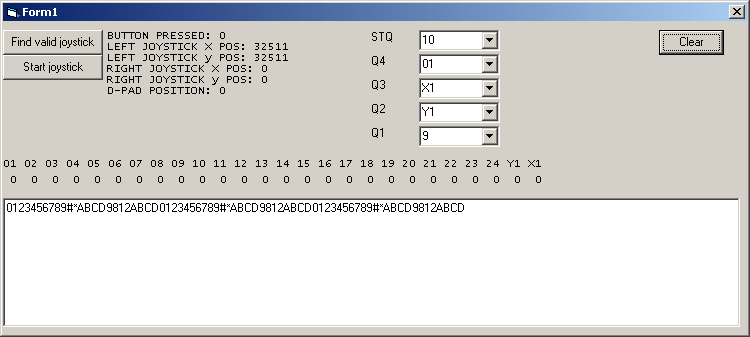
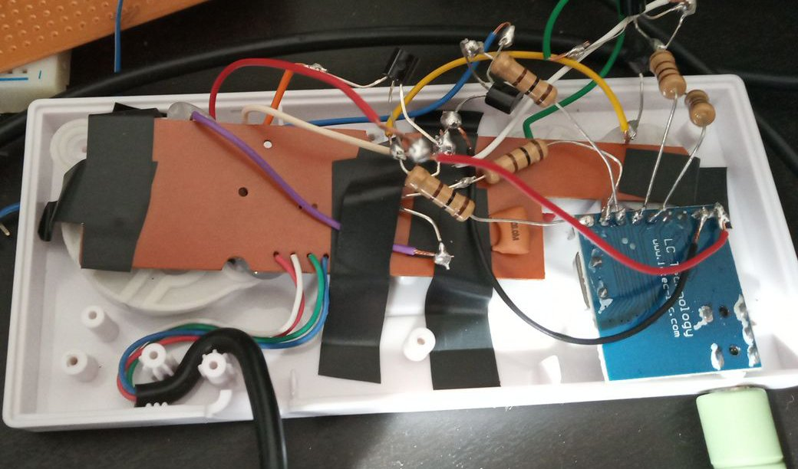
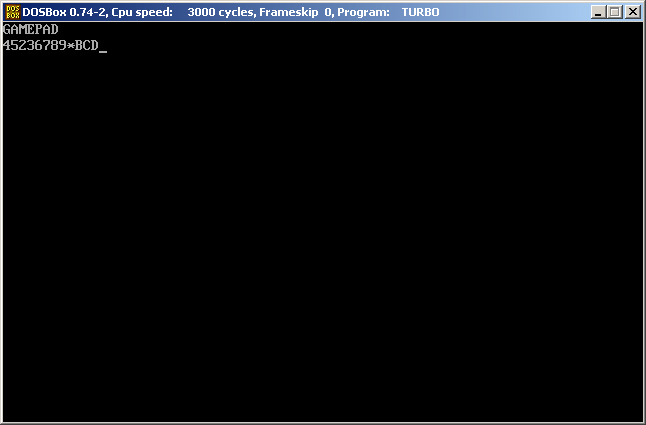
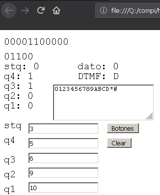

# Gamepad decodificador DTMF
<ul>
 <li>Windows</li>
 <li>MSDOS</li>
 <li>Arduino Uno</li>
 <li>HTML5</li>
 <li>AMSTRAD CPC</li>
 <li>PSX</li>
</ul>
Gracias al chip MT8870, conectando las salidas de STQ, Q4, Q3, Q2 y Q1 a un transistor permitiendo abrir o cerrar
los botones de un GAMEPAD, se puede decodificar tonos DTMF. Tan sólo necesitamos 5 pines (botones de mando).
Se ha creado como prueba de concepto un simple programa en VB6 (para que funcione en equipos viejos W95) para poder
leer los botones y traducirlo a tonos DTMF.
El programa está sin optimizar, así que hay que enviar los tonos lentamente.
Se puede usar el generador de la web
<a href="http://mamclain.com/?page=RND_SOFTWARE_DTMF_WEB_APP">http://mamclain.com/?page=RND_SOFTWARE_DTMF_WEB_APP</a>

Se pueden hacer pruebas con el propio testeador de joystick de Windows

Se recomienda poner 500 ms en el ms Delay Between Digits a la hora de enviar.

Hasta aqui tenemos la parte lógica hardware. Por tanto, entramos en la sección de construir una aplicación que se encargue de traducir las pulsaciones de botones en los códigos binarios que al final son códigos DTMF.
<ul>
 <li><b>0001</b> 1</li>
 <li><b>0010</b> 2</li>
 <li><b>0011</b> 3</li>
 <li><b>0100</b> 4</li>
 <li><b>0101</b> 5</li>
 <li><b>0110</b> 6</li>
 <li><b>0111</b> 7</li>
 <li><b>1000</b> 8</li>
 <li><b>1001</b> 9</li>
 <li><b>1010</b> 10 0</li>
 <li><b>1011</b> 11 *</li>
 <li><b>1100</b> 12 #</li>
 <li><b>1101</b> 13 A</li>
 <li><b>1110</b> 14 B</li>
 <li><b>1111</b> 15 C</li>
 <li><b>0000</b> 16 D</li>
</ul>

El programa en Visual Basic, permite seleccionar que botones queremos usar del mando así, como a que pin del MT8870
está asociado. El mando que se ha usado se ha optado por:
<ul>
 <li><b>STQ</b> (10)</li>
 <li><b>Q4</b> (01)</li>
 <li><b>Q3</b> (X1) He usado la cruceta mover derecho analógico</li>
 <li><b>Q2</b> (Y1) He usado la cruceta mover abajo analógico</li>
 <li><b>Q1</b> (9)</li>
</ul>

El X1 e Y1 son los Ejes X e Y (analógicos). En este caso, es así porque he usado el mando retro de NES usb y sólo
se dispone de 4 botones digitales, siendo la cruceta analógica. En los ASIX (ejes) no se puede pulsar izquierda y
derecha al mismo tiempo, así como arriba o abajo (tenerlo en cuenta a la hora de soldar), así que de los 4 botones,
sólo se pueden usar 2. Recomiendo usar todo botones digitales, y el STQ usarlo siempre digital.

En las lecturas de los Asix (X1 e Y1) al ser analógico se comprueba por código un valor mayor de 33768 para que sea un 1 lógico, ya que significa que hemos pulsado el bóton o a la derecha (mayor a 32768 que sería el centro) o hacia abajo.

El concepto es muy simple, estando la parte más dificil en las manualidades, para dejar el mando bien preparado. El MT8870 se puede alimentar con los 5 voltios del usb, que podemos sacarlo siguiendo los cables del mando con un mulitester. La masa, sigue el mismo concepto.
Los botones de los mandos, normalmente suelen unir 2 circuitos, dejando la masa en común. Para estar seguros miraremos con un multitester la masa. Lo que nos interesa es soldar en la parte del botón que no es masa. Ese parte irá al colector del transistor. Como las masas son comunes, no necesitamos soldar todas esas partes. A la base de cada transistor, debemos conectar una resistencia de 100 Ohmios, como protección. El transistor vale cualquier NPN, en concreto he usado el 2N3904, que es el más simple y barato de conseguir.
Cada salida del MT8870 (STQ, Q4, Q3, Q2 y Q1), van a la resistencia de 100 Ohmios, y esta en serie va a la base del transistor (2N3904), mientras que el colector lo únimos a la parte del botón del mando que queremos activar y el emisor a la masa del mando.

Hay que destacar, que cuanto más barato sea el mando, menos posibilidades existen de que se pueda soldar bien a la parte del botón, por lo que deberemos asegurarnos de poner una vez soldado de manera simple, cola por encima para hacer presión.

Luego hacemos un agujero con el taladro para poder introducir el jack de audio del modulo MT8870 cuando queramos conectarlo para que quede bien, y terminado:

Una vez que probemos el programa, le debemos dar al botón de <b>start joystick</b> y por supuesto tener el gamepad conectado. Si todo es correcto, y se han elegido bien los botones, nos aparecerá el estado de hasta los 24 primeros botones del gamepad y debajo todos los codigos DTMF que se van decodificando en tiempo real, de la fuente de sonido que le hayamos conectado.

<h2>RETRO</h2>
También se encuentra disponible una versión retro <b>(GAMEPAD.PAS)</b> compatible con 8086, para que funcione en cualquier equipo viejo (IBM PC XT), así como emulado por medio del DOSBOX, lo que se traduce en que funciona en casi cualquier plataforma, como por ejemplo ANDROID.
El prototipo está en PASCAL.

Se usa el puerto de joystick con la interrupción 0x15h, usando sólo los 3 bits altos 01110000b de los botones, similar a la versión de VB6, pero aqui no se puede modificar los botones.

<ul>
 <li><b>STQ</b> (bit 7)</li>
 <li><b>Q4</b> (bit 6)</li>
 <li><b>Q3</b> He usado la cruceta mover derecho analógico</li>
 <li><b>Q2</b> He usado la cruceta mover abajo analógico</li>
 <li><b>Q1</b> (bit 5)</li>
</ul>

Debemos pues remapear desde el DOSBOX (pulsar ctrl+F1) los botones del joystick 1 y el 2, de forma que los botones de nuestro gamepad real apunten al joystick virtual a emular (IBM PC):
<ul>
 <li>1 (Axis 1/2) - Q1</li>
 <li>2 (Axis 1/2) - Q4</li>
 <li>3 (Asix 3/4) - STQ</li>
 <li>cruceta derecha - Q3</li>
 <li>cruceta abajo - Q2</li>
</ul>

Como se trabaja desde un emulador, existe un lag, que si ocurren tonos muy seguidos sin separación (silencio), no detecta un cambio de pulso en STQ, por lo que no detectará bien el digito. Se recomienda usar el generador de teclado DTMF a mano, ya que ahi si se introduce silencio.

He dejado una versión minima (228 bytes), pero tiene fallos. Está realizada en C--, pero se puede reducir aún más su tamaño.

<h2>ARDUINO HID</h2>
Si se dispone de una placa Arduino uno R3 ATMEGA328 con el chip de comunicaciones ATMEGA 16u2, se puede hacer uso del código modificado big_joystick_dtmf para poder emular un joystick de 40 botones HID, que se activan por las señales del MT8870 que hemos conectado a los pines:

<ul>
 <li>stq - 2</li>
 <li>q4 - 3</li>
 <li>q3 - 4</li>
 <li>q2 - 5</li>
 <li>q1 - 6</li>
</ul> 

Los botones del mando son:
<ul>
 <li>stq - 10</li>
 <li>q4 - 1</li>
 <li>q3 - 2</li>
 <li>q2 - 3</li>
 <li>q1 - 4</li>
</ul>

Se requiere previamente flashear el chip ATMEGA16u2 con:

https://github.com/harlequin-tech/arduino-usb

Se debe usar la herramienta FLIP y poner el chip en modo DFU.

 
<h2>HTML5</h2>

I have created an html5 version that reads from the gamepad. It makes use of p5js.
 

 
<h2>AMSTRAD CPC 464</h2>

He creado un programa muy sencillo para leer desde el puerto de juego del AMSTRAD CPC 464 en BASIC. Permite decodificar los tonos siguiendo el mismo concepto que hasta ahora. Lo he probado en emulador, así que tienes que remapear los botones o adaptar el código para asignar los pines correctos:

<ul>
 <li>stq - Derecha</li>
 <li>q4 - Arriba</li>
 <li>q3 - Fuego 1</li>
 <li>q2 - Izquierda</li>
 <li>q1 - Abajo</li>
</ul>

Para remapear los botones utilicé el programa antimicro.
<a href="https://github.com/AntiMicro/antimicro">https://github.com/AntiMicro/antimicro</a>
Y el emulador de Winape.

 
<h2>PSX</h2>
He realizado un programa muy simple que lee el estado de los botones del mando de la PSX. Lo he realizado en emulador y  remapeando los botones que necesito. Se ha usado el kit de desarrollo psyq.

<ul>
 <li>stq - Select</li>
 <li>q4 - R2</li>
 <li>q3 - Triangle</li>
 <li>q2 - Square</li>
 <li>q1 - Circle</li>
</ul>

 

<h2>Conclusión</h2>
Con esto conseguimos poder decodificar DTMF con un mando, sin falta de ningún microcontrolador intermedio, y lo más importante, que el concepto se puede aplicar a gamepads viejos (conector MIDI), y equipos retro (MSDOS), así como nuevos, como móviles, pudiendo portar el concepto a HTML5.

Si no queremos compilar el programa, podemos hacer uso de la versión ya compilada
<a href="WINDOWS/VB6/GamePadDTMF.zip">GamePadDTMF.zip</a>
 

<h2>Histórico</h2>
<ul>
 <li><b>2019/12/05</b> PSX port (psyq)</li>
 <li><b>2019/12/04</b> AMSTRAD CPC 464 port</li>
 <li><b>2019/07/23</b> Soporte HTML5</li>
 <li><b>2019/07/21</b> Arduino R3 ATMEGA16u2 big_joystick_dtmf convierte MT8870 en HID joystick</li>
 <li><b>2019/04/23</b> Creada la versión más pequeña del mundo MSDOS y DOSBOX en C-- (228 bytes)</li>
 <li><b>2019/04/22</b> Corregida versión MSDOS (PASCAL) funciona OK</li>
 <li><b>2019/04/19</b> Versión para MSDOS y DOSBOX (PASCAL).</li>
 <li><b>2019/04/18</b> Versión semioptimizada que permite decodificar hasta con 150 milis de espera</li>
</ul>
